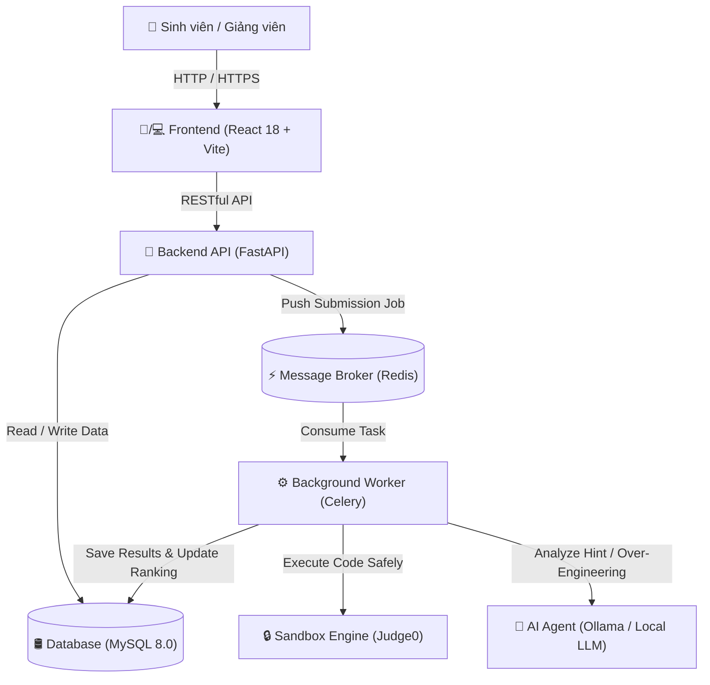

# BÁO CÁO KỸ THUẬT VÀ HƯỚNG DẪN DỰ ÁN (PROJECT DOCUMENTATION)

# DỰ ÁN: INTELLIJUDGE - HỆ THỐNG CHẤM BÀI LẬP TRÌNH TỰ ĐỘNG TÍCH HỢP TRỢ LÝ AI PHÂN TÍCH LỖI & TỐI ƯU MÃ NGUỒN

---

## I. THÔNG TIN TỔNG QUAN DỰ ÁN

- **Tên dự án:** IntelliJudge
- **Lĩnh vực:** Phần mềm Mã nguồn mở Giáo dục (Open Source Educational Software)
- **Loại hình:** Hệ thống chấm bài lập trình trực tuyến (Online Judge) thế hệ mới tích hợp Trợ lý AI Agent
- **Giấy phép mã nguồn mở:** MIT License
- **Mã nguồn (Repository):** [https://github.com/lvquyen15506/IntelliJudge.git](https://github.com/lvquyen15506/IntelliJudge.git)

---

## II. LÝ DO CHỌN ĐỀ TÀI & TÍNH CẤP THIẾT

### 1. Thực trạng của các hệ thống Online Judge truyền thống
Các hệ thống chấm bài lập trình tự động hiện nay (như VNOJ, DMOJ, SPOJ...) đóng vai trò rất quan trọng trong việc luyện tập lập trình. Tuy nhiên, các hệ thống này còn tồn tại một số hạn chế lớn:
- **Thông tin phản hồi nghèo nàn:** Hệ thống chỉ trả về các mã trạng thái thô như `Wrong Answer (WA)`, `Time Limit Exceeded (TLE)`, `Compile Error (CE)` mà không giải thích nguyên nhân logic hoặc hướng dẫn sinh viên tìm vết lỗi.
- **Tình trạng "Học vẹt" khi dùng AI thương mại:** Khi gặp lỗi, sinh viên thường copy code sang ChatGPT / Claude để nhờ "sửa hộ". AI thương mại thường đưa ngay ra code hoàn chỉnh đã sửa, khiến sinh viên chép lại mà không tự suy nghĩ tư duy giải thuật.
- **Bỏ qua khía cạnh Tối ưu mã nguồn (Over-Engineering):** Khi bài làm đạt kết quả Đúng (`Accepted - AC`), sinh viên thường dừng lại. Tuy nhiên, mã nguồn của sinh viên (đặc biệt là sinh viên mới học OOP) thường bị **Over-Engineered** — lạm dụng Class, Interface, con trỏ thông minh `shared_ptr`, cấp phát động trên Heap cồng kềnh thừa thãi trong các bài toán thuật toán đơn giản, làm giảm đáng kể hiệu năng bộ nhớ và CPU.

### 2. Giải pháp sáng tạo của IntelliJudge
IntelliJudge được xây dựng nhằm giải quyết triệt để các vấn đề trên bằng việc kết hợp giữa **Sandbox chấm bài an toàn biệt lập** và **Trợ lý AI Agent Sư phạm**:
1. **AI không rò rỉ mã nguồn sửa sẵn:** Khi sinh viên bị lỗi (WA/TLE/MLE), AI đọc thông tin testcase bị sai, phân tích độ phức tạp $O(...)$ và đưa ra các câu hỏi gợi mở tư duy, hướng dẫn sinh viên kiểm thử trên giấy. **AI bị ràng buộc tuyệt đối không cung cấp code hay mã giả sửa sẵn**.
2. **AI đánh giá Tối ưu & Over-Engineering cho bài AC:** Khi bài nộp đạt `AC`, AI đóng vai trò Chuyên gia Competitive Programming đọc lại code, chỉ ra các đoạn cồng kềnh thừa thãi và định hướng tinh gọn mã nguồn bằng mảng phẳng/cấu trúc dữ liệu tối ưu theo chuẩn Lập trình thi đấu.
3. **Chấm điểm từng phần (Partial Scoring):** Tính điểm linh hoạt theo tỷ lệ số testcase vượt qua, chỉ lấy điểm cao nhất giữa các lần nộp giúp đánh giá chính xác tiến độ học tập.

---

## III. KIẾN TRÚC HỆ THỐNG & CÔNG NGHỆ MÃ NGUỒN MỞ

Dự án tuân thủ 100% tiêu chí Phần mềm Mã nguồn mở với toàn bộ stack công nghệ tự do:

### 1. Bảng công nghệ sử dụng (Open Source Stack Audit)
- **Frontend Layer:** React 18, Vite, TailwindCSS, Monaco Code Editor, Lucide React Icons.
- **Backend API Layer:** Python 3.11, FastAPI (Asynchronous Framework), SQLAlchemy ORM, Pydantic v2.
- **Task Queue & Async Processing:** Celery Task Queue, Redis In-Memory Message Broker.
- **Database Layer:** MySQL 8.0 (với cơ chế tự động Migration Schema khi khởi chạy).
- **Code Execution Sandbox:** Judge0 API v1.13.0 (Chạy cách ly container Docker an toàn tuyệt đối).
- **AI Agent Integration:** Tích hợp Ollama / Local LLM / OpenAI Compatible API (Hỗ trợ Llama 3, Qwen 2.5, DeepSeek R1).
- **Deployment:** Docker & Docker Compose.

### 2. Sơ đồ kiến trúc tổng thể (Mermaid Architecture Diagram)



---

## IV. CÁC TÍNH NĂNG NỔI BẬT CỦA HỆ THỐNG

### 1. Phân tích bài làm & Gợi ý từ Trợ lý AI Agent
- **Gợi ý khi bài lỗi (WA, TLE, MLE, CE):**
  - Giải thích nguyên nhân dẫn đến sự khác biệt giữa Output thực tế và Expected output.
  - Phân tích độ phức tạp thời gian/bộ nhớ hiện tại.
  - Đưa ra 3 hoạt động rèn luyện: Chạy vết (Dry-run) trên giấy, Đặt câu hỏi tự suy ngẫm, Các bước kiểm thử trường hợp biên (Edge Cases).
- **Đánh giá tối ưu khi bài đạt AC:**
  - Nhận xét tính tối ưu về CPU và RAM.
  - Phát hiện lỗi Over-Engineering (lạm dụng OOP/con trỏ thông minh/cấp phát động).
  - Hướng dẫn tinh gọn code bằng lời văn diễn giải sư phạm.

### 2. Hệ thống Tính điểm từng phần (Partial Scoring) & Bảng Xếp Hạng
- **Điểm từng testcase:** 
  $$\text{Điểm bài nộp} = \frac{\text{Số testcase AC}}{\text{Tổng số testcase}} \times \text{Điểm tối đa bài tập}$$
- **Nguyên tắc lấy điểm cao nhất:** Bảng xếp hạng tự động lọc và ghi nhận **điểm số cao nhất (`MAX(points)`)** giữa các lần nộp của mỗi bài tập, tránh tình trạng cộng dồn điểm trùng lặp khi nộp lại nhiều lần.

### 3. Giao diện Execution Results chuẩn Online Judge
- Hiển thị danh sách kết quả testcase bằng biểu tượng trực quan:
  - `✓` (Chấp nhận - AC)
  - `✗` (Trả lời sai - WA)
  - `-` (Bỏ qua - SKIPPED)
- Thống kê chi tiết tổng tài nguyên sử dụng: Thời gian thực thi ($ms$), Bộ nhớ sử dụng ($MB$) và tổng điểm bài nộp.

### 4. Trình soạn thảo IDE Responsive trên Mobile & PC
- Tích hợp **Monaco Editor** hỗ trợ highlight cú pháp C++, Python.
- Tự động chuyển đổi Tab thông minh trên giao diện di động (`[ 📄 Đề bài ]` vs `[ 💻 Làm bài (IDE) ]`).

---

## V. HƯỚNG DẪN TRIỂN KHAI & CHẠY DEMO (QUICK START)

### 1. Yêu cầu môi trường
- Hệ điều hành: Linux / macOS / Windows (hỗ trợ Docker Desktop).
- Đã cài đặt `docker` và `docker-compose`.

### 2. Các bước khởi chạy 1 lệnh duy nhất

```bash
# Bước 1: Clone repository từ GitHub
git clone https://github.com/lvquyen15506/IntelliJudge.git
cd IntelliJudge

# Bước 2: Khởi chạy toàn bộ 5 dịch vụ bằng Docker Compose
docker compose up -d --build
```

### 3. Truy cập hệ thống
- **Giao diện người dùng (Frontend):** `http://localhost:5173`
- **Tài liệu Swagger API (Backend):** `http://localhost:8000/docs`
- **Tài khoản dùng thử mặc định:**
  - **Super Admin (Quản trị viên):** Tài khoản `admin_root` / Mật khẩu `adminpassword`
  - **Student (Học sinh):** Tài khoản `student1` / Mật khẩu `student123`

---

## VI. TUÂN THỦ QUY ĐỊNH GIẤY PHÉP MÃ NGUỒN MỞ (OPEN SOURCE COMPLIANCE)

1. **Giấy phép mã nguồn mở (LICENSE):** Dự án đăng ký giấy phép **MIT License**, cho phép cộng đồng hoàn toàn tự do sao chép, nghiên cứu, phát triển và tích hợp.
2. **Công khai mã nguồn (Public Repository):** Mã nguồn đầy đủ của Frontend, Backend, Dockerfile và tài liệu được lưu trữ công khai tại GitHub: `https://github.com/lvquyen15506/IntelliJudge.git`.
3. **Bảo mật & Sạch sẽ:** File `.gitignore` đã loại bỏ hoàn toàn các file tạm, thư viện phụ thuộc (`node_modules`, `venv`) và chìa khóa bảo mật.

---

## VII. ĐỊNH HƯỚNG PHÁT TRIỂN TRONG TƯƠNG LAI

1. **Hỗ trợ thêm các ngôn ngữ mới:** Java, Go, Rust, JavaScript (Node.js).
2. **Tích hợp mô hình kiểm tra gian lận (Plagiarism Detection):** Sử dụng giải thuật Moss / AST Tree Comparison để phát hiện học sinh chép bài nhau.
3. **Tính năng Contest Real-time:** Hỗ trợ tổ chức kỳ thi thời gian thực với bảng xếp hạng nhảy điểm trực tiếp qua WebSocket (Real-time Leaderboard).

---
*Báo cáo được khởi tạo tự động cho Hệ thống Chấm bài Lập trình IntelliJudge - 2026.*
