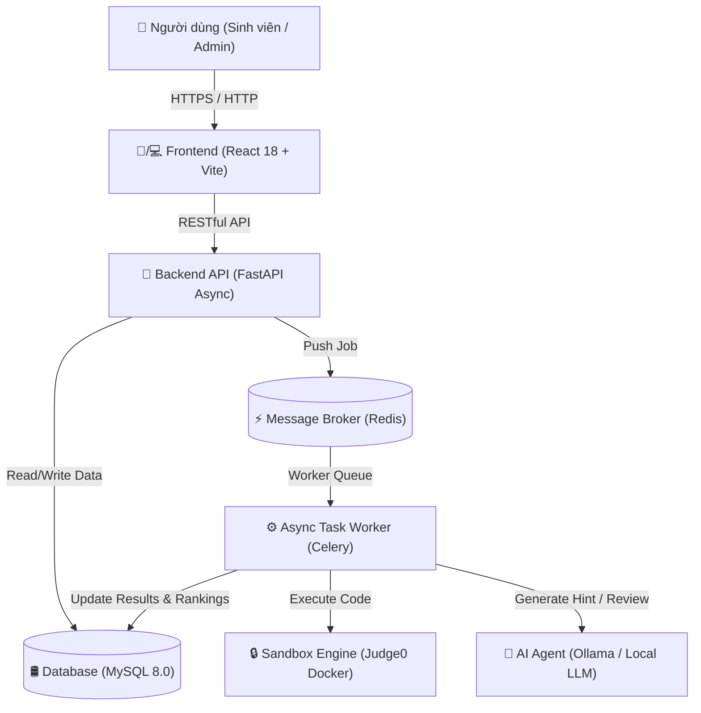

# BÁO CÁO PHẦN MỀM MÃ NGUỒN MỞ (PMNM)

# THỨC NĂNG DỰ ÁN: INTELLIJUDGE - HỆ THỐNG CHẤM BÀI LẬP TRÌNH TỰ ĐỘNG TÍCH HỢP TRỢ LÝ AI PHÂN TÍCH LỖI & TỐI ƯU MÃ NGUỒN

---

## BẢNG THÔNG TIN DỰ ÁN (PROJECT METADATA)

- **Tên sản phẩm:** IntelliJudge
- **Tên dự án mã nguồn mở:** IntelliJudge - Smart Online Judge with AI Pedagogical Assistant
- **Hạng mục dự án:** Phần mềm Mã nguồn mở (PMNM)
- **Giấy phép mã nguồn mở (Open Source License):** MIT License
- **Đường dẫn mã nguồn công khai (Repository):** [https://github.com/lvquyen15506/IntelliJudge.git](https://github.com/lvquyen15506/IntelliJudge.git)
- **Phiên bản (Version):** v1.0.0 (Release Version)

---

## CHƯƠNG I: TỔNG QUAN VỀ DỰ ÁN

### 1.1 Mục đích và Lý do chọn đề tài
Trong kỷ nguyên công nghệ thông tin phát triển mạnh mẽ, việc giảng dạy và luyện tập lập trình đóng vai trò nòng cốt tại các trường đại học, cao đẳng. Các hệ thống chấm bài trực tuyến (Online Judge - OJ) như SPOJ, VNOJ, LeetCode... đã hỗ trợ đắc lực trong việc tự động hóa khâu chấm điểm. 

Tuy nhiên, các hệ thống OJ hiện nay đang tồn tại hai bất cập lớn:
1. **Thông tin phản hồi thụ động, nghèo nàn:** Khi nộp bài sai, sinh viên chỉ nhận được các mã lỗi thô như `Wrong Answer (WA)`, `Time Limit Exceeded (TLE)` hoặc `Compile Error (CE)`. Điều này khiến sinh viên (đặc biệt là sinh viên năm nhất/năm hai) gặp nhiều khó khăn trong việc định vị lỗi logic.
2. **Lệ thuộc vào AI thương mại và hiện tượng "Học vẹt":** Khi gặp lỗi, sinh viên thường đưa đề bài và code sang các công cụ như ChatGPT để xin giải đáp. Các công cụ này thường trả về ngay **mã nguồn sửa sẵn hoàn chỉnh**, làm triệt tiêu tư duy tự học, dẫn đến việc sinh viên chép code mà không hiểu bản chất.
3. **Bỏ qua khía cạnh Over-Engineering khi bài nộp đạt Accepted (AC):** Khi bài làm đã đỗ 100% testcase, sinh viên dừng lại mà không biết rằng mã nguồn của mình đang mắc lỗi **Over-Engineering** — lạm dụng Lập trình hướng đối tượng (OOP), con trỏ thông minh (`shared_ptr`), cấp phát động trên Heap cồng kềnh thừa thãi trong các bài toán thuật toán đơn giản, làm tổn hại nặng nề đến hiệu năng bộ nhớ và CPU.

**Dự án IntelliJudge** được ra đời nhằm giải quyết triệt để các hạn chế trên bằng việc kết hợp giữa **Sandbox chấm bài an toàn cách ly tuyệt đối** và **Trợ lý AI Agent Sư phạm (Pedagogical AI Agent)** đóng vai trò như một người thầy đồng hành cùng sinh viên.

---

## CHƯƠNG II: ĐÁNH GIÁ TÍNH NGUỒN MỞ VÀ GIẤY PHÉP (OPEN SOURCE COMPLIANCE)

### 2.1 Lựa chọn Giấy phép Mã nguồn mở (Open Source License)
Dự án **IntelliJudge** lựa chọn đăng ký dưới giấy phép **MIT License**. Đây là giấy phép mã nguồn mở tự do được sáng lập bởi Viện Công nghệ Massachusetts (MIT) và được công nhận rộng rãi bởi Tổ chức Mã Nguồn Mở (Open Source Initiative - OSI).

**Ưu điểm của Giấy phép MIT:**
- Cho phép cộng đồng tự do sao chép, nghiên cứu, sửa đổi, phân phối lại và tích hợp thương mại/phi thương mại.
- Đảm bảo tính minh bạch, hỗ trợ tối đa cho sinh viên và các cơ sở giáo dục dễ dàng đóng góp mã nguồn.

### 2.2 Bảng kê khai chi tiết các thư viện & công nghệ mã nguồn mở (Dependency Matrix)

Dự án tuân thủ 100% việc sử dụng phần mềm & thư viện mã nguồn mở:

| STT | Thành phần | Phần mềm / Thư viện | Giấy phép (License) | Vai trò trong hệ thống |
| :---: | :--- | :--- | :--- | :--- |
| 1 | **Language** | Python 3.11 | PSF License | Ngôn ngữ phát triển Backend chính |
| 2 | **Backend** | FastAPI | MIT License | Asynchronous Web API Framework |
| 3 | **ORM** | SQLAlchemy 2.0 | MIT License | Quản lý và truy vấn CSDL bất đồng bộ |
| 4 | **Database** | MySQL 8.0 | GPL v2 / Community | Cơ sở dữ liệu quan hệ lưu trữ chính |
| 5 | **Task Queue** | Celery + Redis | BSD License | Quản lý hàng đợi và xử lý tác vụ chấm bài bất đồng bộ |
| 6 | **Sandbox** | Judge0 API Engine | GPL v3 | Môi trường Docker cách ly chấm code an toàn |
| 7 | **LLM Engine** | Ollama / Local LLM | MIT / Open-Weight | Nền tảng thực thi mô hình AI tại chỗ (Local AI) |
| 8 | **Frontend** | React 18 + Vite | MIT License | Xây dựng giao diện người dùng Single Page Application |
| 9 | **Styling** | TailwindCSS | MIT License | Framework CSS tiện ích thiết kế giao diện |
| 10 | **Editor** | Monaco Code Editor | MIT License | Trình soạn thảo mã nguồn tích hợp (từ VS Code) |
| 11 | **Icons** | Lucide React Icons | ISC License | Biểu tượng giao diện đồ họa |
| 12 | **Server** | Nginx Alpine | 2-clause BSD | Web server làm Reverse Proxy cho Frontend |

### 2.3 Phân tích tính tương thích Giấy phép (License Compatibility)
Tất cả các phần mềm phụ thuộc (Dependencies) mang giấy phép **MIT, BSD, ISC, GPL v2/v3** đều tương thích hoàn toàn với nhau khi được đóng gói dưới dạng các Dịch vụ Container độc lập (Microservices Container Architecture).

### 2.4 Quản lý mã nguồn mở công khai (Git Workflow)
- Kho chứa mã nguồn công khai tại GitHub với cây thư mục chuẩn hóa.
- Tệp `.gitignore` được cấu hình nghiêm ngặt: loại bỏ các tệp tin rác, thư viện đóng gói (`node_modules`, `venv`) và các chìa khóa bảo mật môi trường.

---

## CHƯƠNG III: YÊU CẦU VÀ THIẾT KẾ HỆ THỐNG (SYSTEM DESIGN)

### 3.1 Yêu cầu Chức năng (Functional Requirements)

1. **Phân hệ Học sinh / Người dùng:**
   - Đăng ký, đăng nhập và quản lý thông tin cá nhân.
   - Xem danh sách bài tập, lọc theo chủ đề/thẻ (Tags) và độ khó.
   - Làm bài với Trình soạn thảo IDE Monaco (Hỗ trợ C++, Python).
   - Xem kết quả thực thi từng testcase trực quan (`✓`, `✗`, `-`).
   - Xem báo cáo phân tích gợi ý tư duy & đánh giá Over-Engineering từ AI Agent.
   - Xem Bảng xếp hạng điểm số cá nhân và toàn hệ thống.

2. **Phân hệ Quản trị viên (Admin / Super Admin):**
   - Quản lý đề bài (Thêm, Sửa, Xóa đề bài, thiết lập thời gian, bộ nhớ, điểm số).
   - Thêm/Sửa danh sách testcase (Cả testcase công khai và testcase ẩn).
   - Import đề bài và bộ testcase hàng loạt từ file nén `.ZIP`.
   - Quản lý tài khoản người dùng và phân quyền hệ thống.

3. **Phân hệ Sandbox Chấm bài & AI Agent:**
   - Thực thi mã nguồn sinh viên trong môi trường container bị giới hạn CPU/RAM.
   - Tính điểm từng phần (Partial Scoring) dựa trên tỷ lệ testcase vượt qua.
   - Tự động gọi mô hình LLM sinh báo cáo sư phạm (Không rò rỉ mã nguồn sửa sẵn).

### 3.2 Yêu cầu Phi chức năng (Non-Functional Requirements)
- **Tính an toàn (Security & Isolation):** Mã nguồn sinh viên nộp lên không được phép truy cập file system hệ thống chính hay gọi socket mạng trái phép.
- **Tính bất đồng bộ (Asynchrony & Scalability):** Hệ thống không bị treo hoặc rớt kết nối khi có hàng trăm sinh viên nộp bài cùng lúc nhờ hàng đợi Celery + Redis.
- **Tính đáp ứng (Responsive UI):** Giao diện tự động co giãn và tối ưu chuyển đổi Tab trên cả máy tính bàn và điện thoại di động.

### 3.3 Sơ đồ Kiến trúc Hệ thống (System Architecture)



---

## CHƯƠNG IV: HIỆN THỰC HÓA SẢN PHẨM VÀ TÍNH NĂNG ĐỘC ĐÁO

### 4.1 Sandbox Chấm bài an toàn biệt lập (Judge0 Integration)
Mã nguồn của sinh viên khi nộp lên được Celery Worker chuyển tới Sandbox Judge0. Sandbox này sử dụng công nghệ Docker Container cách ly tài nguyên:
- Giới hạn thời gian chạy CPU (CPU Time Limit: mặc định $1.0s$).
- Giới hạn dung lượng RAM (Memory Limit: mặc định $256MB$).
- Vô hiệu hóa các quyền hệ thống độc hại (chống gọi `system()`, mở socket trái phép).

### 4.2 Ràng buộc Prompt Sư phạm cho AI Agent (Pedagogical Prompt Engineering)
Độ phá phá lớn nhất của IntelliJudge nằm ở kỹ thuật thiết kế Prompt có ràng buộc nghiêm ngặt với mô hình LLM:

1. **Ràng buộc tuyệt đối khi bài lỗi (WA, TLE, MLE):**
   - AI được cung cấp Input, Expected Output và Actual Output.
   - **RÀNG BUỘC TUYỆT ĐỐI:** AI không được phép viết bất kỳ dòng code, struct/class mẫu hay mã giả nào.
   - AI chỉ phân tích nguyên nhân bằng lời văn, chỉ ra trường hợp biên và đặt câu hỏi tự suy ngẫm để sinh viên tự phát hiện lỗi.

2. **Ràng buộc khi bài làm đạt Accepted (AC):**
   - AI đọc mã nguồn sinh viên, phát hiện việc phức tạp hóa bài toán (Over-Engineering).
   - AI phân tích ảnh hưởng của over-engineering tới tốc độ CPU cache và overhead bộ nhớ.
   - **RÀNG BUỘC:** AI hoàn toàn dùng lời văn mô tả hướng tinh gọn mảng phẳng/vector thay vì đưa mã mẫu.

### 4.3 Giải thuật Tính điểm từng phần & Bảo lưu điểm cao nhất
- **Công thức tính điểm bài nộp:**
  $$\text{Submission Points} = \frac{\text{Số testcase AC}}{\text{Tổng testcase}} \times \text{Điểm bài tập}$$
- **Thuật toán Bảng xếp hạng:**
  $$\text{Total Score}_{User} = \sum_{P \in \text{Problems}} \max_{s \in \text{Submissions}(User, P)} (s.\text{points})$$
  Đảm bảo mỗi bài nộp trùng lặp chỉ lấy điểm số lớn nhất, không gây hiện tượng cộng dồn ảo.

---

## CHƯƠNG V: THỬ NGHIỆM VÀ ĐÁNH GIÁ KẾT QUẢ

### 5.1 Bảng so sánh với các giải pháp hiện có trên thị trường

| Tiêu chí | Online Judge Truyền thống (VNOJ/SPOJ) | AI Thương mại (ChatGPT/Claude) | IntelliJudge (Dự án PMNM) |
| :--- | :---: | :---: | :---: |
| **Chấm code tự động Sandbox** | ✅ Có | ❌ Không | ✅ Có (Judge0) |
| **Giải thích nguyên nhân lỗi** | ❌ Chỉ hiện WA/TLE | ⚠️ Diễn giải chung chung | ✅ Phân tích theo testcase sai |
| **Tránh rò rỉ mã nguồn sửa sẵn** | ❌ Không có AI | ❌ Trả ngay 100% code | ✅ Cấm code tuyệt đối |
| **Đánh giá Over-Engineering (Bài AC)** | ❌ Không có | ❌ Chỉ khen hoặc bỏ qua | ✅ Đọc lại code & nhận xét tinh gọn |
| **Tính điểm từng phần (Partial Score)** | ⚠️ Tùy hệ thống | ❌ Không có | ✅ Có sẵn |
| **Mã nguồn mở & Triển khai Docker** | ⚠️ Phức tạp | ❌ Mã nguồn đóng | ✅ 1-Command Docker Compose |

---

## CHƯƠNG VI: KHẢ NĂNG ỨNG DỤNG VÀ ĐÓNG GÓP CỘNG ĐỒNG

### 6.1 Giá trị ứng dụng thực tiễn trong giáo dục
- **Dành cho Sinh viên:** Nâng cao tư duy tự lập trình, không ỷ 赖 chép code AI, tiếp thu phong cách viết code tinh gọn chuẩn thi đấu.
- **Dành cho Giảng viên & Nhà trường:** Giảm tải khối lượng giải đáp thắc mắc thủ công, dễ dàng tổ chức chấm bài tự động và theo dõi bảng xếp hạng sinh viên.

### 6.2 Hướng phát triển trong tương lai
1. Mở rộng hỗ trợ thêm các ngôn ngữ mới: Java, Go, Rust.
2. Tích hợp module kiểm tra gian lận (Plagiarism Detection) dựa trên cây cú pháp AST.
3. Hỗ trợ kỳ thi thời gian thực với bảng xếp hạng nhảy điểm trực tiếp qua WebSocket (Real-time Leaderboard).

---

## CHƯƠNG VII: HƯỚNG DẪN TRIỂN KHAI VÀ CHẠY DEMO

```bash
# Clone repository
git clone https://github.com/lvquyen15506/IntelliJudge.git
cd IntelliJudge

# Khởi chạy toàn bộ hệ thống bằng Docker Compose
docker compose up -d --build
```

- **Giao diện Frontend:** `http://localhost:5173`
- **Swagger API Specs:** `http://localhost:8000/docs`
- **Tài khoản mặc định:**
  - **Super Admin:** `admin_root` / `adminpassword`
  - **Student:** `student1` / `student123`

---
*Báo cáo được biên soạn hoàn chỉnh phục vụ Hội thi Phần mềm Mã nguồn mở (PMNM) — Dự án IntelliJudge 2026.*
