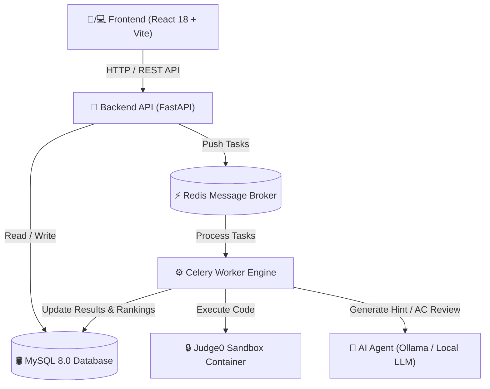

# 🏆 IntelliJudge - Hệ Thống Chấm Bài Lập Trình Tự Động Tích Hợp Trợ Lý AI Phân Tích Lỗi & Tối Ưu Mã Nguồn

[](LICENSE)
[](https://github.com/lvquyen15506/IntelliJudge/releases/tag/v1.0.0)
[](https://www.python.org/)
[](https://fastapi.tiangolo.com/)
[](https://react.dev/)
[](https://www.docker.com/)

**IntelliJudge** là hệ thống chấm bài lập trình trực tuyến (Online Judge - OJ) thế hệ mới dành cho giáo dục, kết hợp giữa Sandbox chấm điểm tự động an toàn và **Trợ lý AI Agent thông minh**. Hệ thống không chỉ kiểm thử tính đúng đắn của mã nguồn qua từng testcase mà còn đóng vai trò như một người Giảng viên hướng dẫn tư duy giải thuật, phát hiện code **Over-Engineering** và giúp sinh viên rèn luyện tư duy lập trình tối ưu.

---

## ✨ Các Tính Năng Nổi Bật

### 1. 🤖 Trợ Lý AI Hướng Dẫn Tư Duy (Không Rò Rỉ Code)
- **Phân tích bài làm bị lỗi (WA, TLE, MLE, CE):** AI đọc thông tin testcase bị sai, phân tích độ phức tạp $O(...)$, gợi ý hướng suy nghĩ và các bước kiểm thử trên giấy. **Ràng buộc tuyệt đối không đưa ra mã nguồn hay mã giả sửa sẵn** để sinh viên tự động não làm bài.
- **Đánh giá tối ưu & Over-Engineering cho bài AC (Accepted):** Khi bài làm đã vượt qua 100% testcase, AI đóng vai trò Chuyên gia Competitive Programming phát hiện việc lạm dụng OOP, `shared_ptr`, interface hay cấp phát động cồng kềnh thừa thãi, gợi ý hướng tinh gọn bằng lời văn theo tiêu chuẩn Lập trình thi đấu.

### 2. 📊 Hệ Thống Điểm Từng Phần (Partial Scoring) & Bảng Xếp Hạng
- **Điểm từng testcase:** Mỗi bài nộp được tính điểm chính xác dựa trên tỷ lệ số testcase đã vượt qua ($\text{Điểm} = \frac{\text{Số testcase AC}}{\text{Tổng testcase}} \times \text{Điểm bài tập}$).
- **Chỉ lấy điểm cao nhất:** Bảng xếp hạng tự động lấy **điểm số cao nhất** trong các lần nộp của từng bài tập, tránh cộng dồn bài nộp trùng lặp.

### 3. 🧪 Giao Diện Kết Quả Thực Thi Chi Tiết (Execution Results)
- Hiển thị trực quan trạng thái từng testcase với biểu tượng chuẩn Online Judge (`✓` Chấp nhận, `✗` Trả lời sai, `-` Bỏ qua).
- Thống kê chi tiết thời gian chạy ($ms$), bộ nhớ sử dụng ($MB$) và tổng điểm của bài làm.

### 4. 💻 Trình Soạn Thảo IDE Responsive Tối Ưu Cho Mobile & PC
- Tích hợp **Monaco Editor** với phím tắt, highlight cú pháp chuẩn xác.
- Hỗ trợ chuyển đổi Tab mượt mà trên thiết bị di động (`[ 📄 Đề bài ]` vs `[ 💻 Làm bài ]`).

---

## 🛠️ Công Nghệ Mã Nguồn Mở (100% Open Source Stack)

Dự án tuân thủ 100% tiêu chí Phần mềm Mã nguồn mở (PMNM) với toàn bộ thành phần công nghệ có giấy phép tự do (MIT, BSD, GPL, Apache):

- **Backend:** Python 3.11, FastAPI, SQLAlchemy, PyMySQL, Celery, Redis, MySQL 8.0.
- **Sandbox Execution Engine:** Judge0 API (v1.13.0 - Dockerized Sandbox).
- **AI Agent LLM:** Tích hợp Ollama / Local LLM / OpenAI Compatible API (Llama 3, Qwen 2.5, DeepSeek R1).
- **Frontend:** React 18, Vite, TailwindCSS, Monaco Editor, Lucide React Icons, Nginx.

---

## 🏗️ Kiến Trúc Hệ Thống (Architecture)



---

## 🚀 Hướng Dẫn Cài Đặt Nhanh (Quick Start)

### Yêu cầu tiên quyết:
- [Docker](https://www.docker.com/) & [Docker Compose](https://docs.docker.com/compose/)
- Cổng 5173 (Frontend), 8000 (Backend), 3306 (MySQL), 6379 (Redis), 2358 (Judge0) trống.

### Các bước khởi chạy 1 lệnh duy nhất:

```bash
# 1. Clone repository mã nguồn mở
git clone https://github.com/lvquyen15506/IntelliJudge.git
cd IntelliJudge

# 2. Khởi chạy toàn bộ hệ thống bằng Docker Compose
docker compose up -d --build
```

Sau khi khởi chạy thành công:
- **Giao diện người dùng (Frontend):** `http://localhost:5173`
- **Tài liệu Swagger API (Backend):** `http://localhost:8000/docs`
- **Tài khoản dùng thử (Default Seed Accounts):**
  - **Super Admin:** `admin_root` / `adminpassword`
  - **Học sinh:** `student1` / `student123`

---

## 📄 Giấy Phép Mã Nguồn Mở (License)

Dự án được phát hành theo giấy phép **[MIT License](LICENSE)**. Bạn hoàn toàn có quyền sử dụng, nghiên cứu, sửa đổi và phân phối lại mã nguồn theo thể lệ của các cuộc thi Phần mềm Mã nguồn mở.
